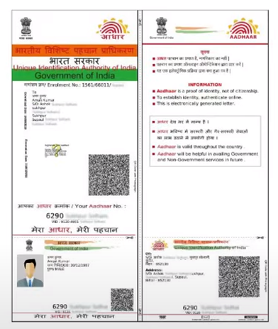
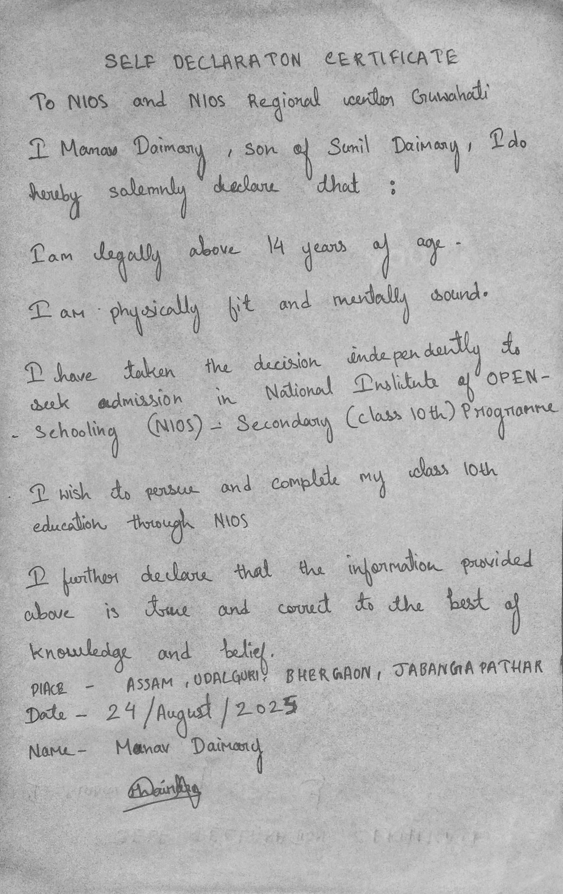
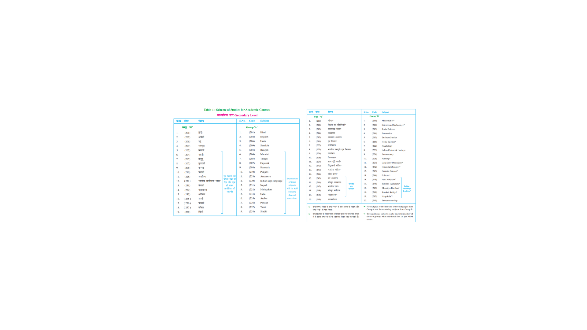
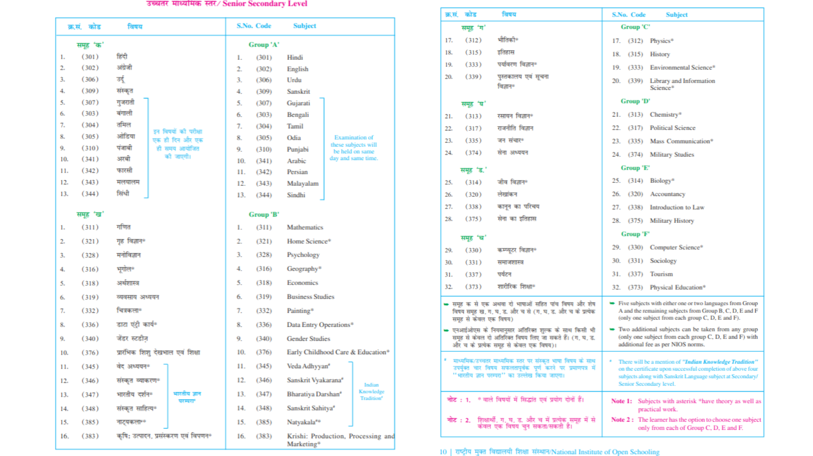

<!DOCTYPE html>
<html lang="en">
<head>
<meta charset="UTF-8">
<meta name="viewport" content="width=device-width, initial-scale=1.0">
<title>NIOS Admission Guide</title>

</head>
<body>

<h1>Admission</h1>

<strong>Admissions are completely online at <a href="https://sdmis.nios.ac.in" target="_blank">sdmis.nios.ac.in</a>
 only</strong> (for 12th (Sr. Sec), 10th (Sec), and OBE).

--- 
 

# How TO Take Admission In NIOS 10th or 12th - Full guides

📘 How to Take Admission in NIOS 10th (Secondary) as a Fresher & for failed Students - Full guide.

  **[Admission deadline and fees ?](https://sdmis.nios.ac.in/home/fees)**

<h2>1. Who Can Take Admission?</h2>

<h3><strong>Freshers</strong></h3>

Anyone who is <strong>14 years or above</strong>.

<h3><strong>Failed Students</strong></h3>

Anyone who has <strong>failed in 9th or 10th</strong> in a regular school can also take admission directly, 
either as a fresher or using <strong>TOC (Transfer of Credit)</strong>.

<h2>Extra Info for Failed Students Only (TOC)</h2>

NIOS allows transferring marks of <strong>up to 2 passed subjects</strong> from your previous board. 
This is called <strong>TOC – Transfer of Credit</strong>.

<h3>TOC Rules:</h3>
<ul>
<li>Only for <strong>failed students</strong></li>
<li>Maximum <strong>2 subjects</strong> are allowed</li>
<li>The subject must exist in <strong>NIOS subject list</strong></li>
<li>TOC fee: <strong>₹230 per subject</strong> (Notification 37/2024)</li>
<li>You must send your <strong>original failed marksheet</strong> to your NIOS Regional Centre 
+ a copy of your admission form</li>
<li>If you don't send it → <strong>TOC will not be applied</strong></li>
</ul>

<h2>2. You Can Take Admission Yourself (Avoid Middlemen)</h2>

Many students go to cybercafés or agents who charge <strong>too much</strong> for a very simple process. 
Most of them even <strong>fill the form incorrectly</strong>.

<strong>Truth:</strong> You can complete NIOS admission yourself in <strong>15–20 minutes</strong>. 
It is simple, not rocket science.

<h2>3. Documents Needed</h2>

<h3>(a) Digital Aadhaar Card</h3>

Download the digital copy of your Aadhaar from the <strong>UIDAI website</strong>.

📌 Aadhaar Example (Click to View)

  

<h3>(b) Passport-size Photo</h3>

A formal photo is required. 
You can click it on your phone — just keep it clean, not like an Instagram selfie.

<h3>(c) Identity Proof</h3>

Aadhaar works as both ID and address proof.

<h3>(d) Self-Declaration Certificate — <strong>Most Important</strong></h3>

NIOS needs proof that:

<ul>
<li>You are <strong>above 14 years</strong>, and</li>
<li>You want to take <strong>admission in NIOS 10th</strong></li>
</ul>

If you don't upload a self-declaration, NIOS may ask for more school documents — 
and <strong>you don't want that headache</strong>.

Even if you don't have 8th/9th mark sheets, a <strong>self-declaration is enough</strong>.

📌 Self-Declaration Example (Click to View) 

   

<h3>(e) For Failed Students</h3>

Upload your <strong>10th failed marksheet</strong> — 
digital copy from DigiLocker / clear phone photo / result website screenshot - any thing will work here.

<h2>4. Step-by-Step Admission Process</h2>

<h3><strong>Step 1:</strong></h3>

Search on Google → <strong>"NIOS online admission portal"</strong>  
Open: <strong>sdmis.nios.ac.in</strong>

<h3><strong>Step 2:</strong></h3>

Go to: 
<strong>Admission → Stream 1 → Secondary Course (10th)</strong>

<h3><strong>Step 3:</strong> Fill Basic Details</h3>

Enter:

<ul>
<li>Name</li>
<li>DOB</li>
<li>Parents' names</li>
<li>Mobile number</li>
<li>Aadhaar or PAN number</li>
<li>Address</li>
</ul>

⚠️ <strong>Everything must match word-for-word with your documents.</strong>

No spelling mistakes, no incorrect surnames, no wrong DOB.

<h2>Important Address Details</h2>

<h3><strong>Permanent Address</strong></h3>

Must be <strong>exactly as on Aadhaar</strong>.

<h3><strong>Correspondence Address</strong></h3>
<ul>
<li>If your current living address is the same as your Aadhaar address → then keep it the same</li>
<li>If the current living address is different, → Then you must upload proof of that address so you will get the study centre and exam centre in that state and city</li>
</ul>

Accepted proofs: (Any document in your or your parents' name)

<ul>
<li>Gas bill</li>
<li>Electricity bill</li>
<li>Water bill</li>
<li>Rent agreement</li>
<li>Bank statement</li>
</ul>

<h2>Step 4: Select Subject</h2>

You can choose <strong>5 to 7 subjects</strong>. 
Minimum requirement: <strong>1 language + 4 other subjects</strong>

1. a) You are required to take <strong>at least 1 language subject</strong>.

b) You <strong>can take up to 2 language subjects</strong>, e.g., Hindi and English

2. a) NIOS lets you choose any subject; however, you <strong>MUST</strong> choose your subjects according to your future career/goals.

c) Don't think that you can complete 12th in one year. <strong>If you passed out of 10th, you are required to maintain a 1-year gap between passing 10th and completing 12th.</strong>

📌 See Subjects Available in NIOS for 10th (Click to Open)

  

<h2>Step 5: Choose Good Nearest Study Centre</h2>

Your study centre is where:

<ul>
<li>Practical exams happen</li>
<li>You Get TMA Marks from here </li>
<li>You receive Documents after passing</li>
</ul>

So pick a good study centre - Search their name on Google, see how the school looks on Google Maps, and see if they have good infrastructure!

Best study centres generally are -

<ul>
<li>Kendriya Vidyalayas(KVs) or Army Schools</li>
<li>DPS / DAV / GD Goenka / FAS</li>
<li>Reputed private or government schools</li>
</ul>

<h2>Step 6: Upload Your Documents</h2>

Upload in these sections:

<ul>
<li><strong>Photo</strong> → Your formal photo</li>
<li><strong>Signature</strong> → photo of your signature</li>
<li><strong>Identity Proof</strong> → digital Aadhaar</li>
<li><strong>Previous Qualification Certificate</strong> → upload <strong>Self-Declaration</strong></li>
<li><strong>Correspondence Address Proof</strong></li>
<li>Aadhaar (if same address)</li>
<li>If your living address is not same as the Aadhar card, then upload other proof of living address--
<ul>
<li>Accepted proofs: (Can be Any document in your or your parents' name)</li>
<li>Gas bill</li>
<li>Electricity bill</li>
<li>Water bill</li>
<li>Rent agreement</li>
<li>Bank statement )</li>
</ul>
</li>
</ul>

<h2>Step 7: Pay Admission Fees</h2>

Payment gateways available:

<ul>
<li><strong>UBI</strong></li>
<li><strong>BOI</strong></li>
</ul>

<h2>Step 8: Download Confirmation Copy</h2>

Go to <strong>Print</strong> option and download:

<ul>
<li>Admission form</li>
<li>Payment receipt</li>
</ul>

<h2>Step 9: Admission Confirmation</h2>

If you have filled everything correctly, then admission will be confirmed in <strong>30–60 days</strong>. 
This is normal — don't panic or lose your brain.

You will receive an <strong>email</strong>, and you can also check inside your NIOS login.

<h3>Keep These Safe</h3>
<ul>
<li>Reference number</li>
<li>Registered email</li>
<li>NIOS password</li>
</ul>

You'll need them again and again.

<h2>After Admission – What Next?</h2>

Here, Now you should read these guides on what happens next? What do you have to do next? -

<h3>Good to know things just after admission:</h3>

 

📘 How to take admission in NIOS Senior Secondary (12th Standard) as a fresher or as a 12th failed student!!

<h3>Simple Guide for Freshers, and failed students to take admission IN NIOS 12th</h3>

  **[Admission deadline and fees ?](https://sdmis.nios.ac.in/home/fees)**

<h2>1. Who Can Take Admission?</h2>

<h3><strong>Freshers / New Students</strong></h3>
<ul>
<li>Anyone who is or above: 15</li>
<li>Has passed <strong>10th class</strong> from any recognized board.</li>
</ul>

<h3>🧒 NIOS 10th → 12th Gap Rule (Very Simple)</h3>

Think of it like this 
NIOS wants 2 years gap between: 
when you pass 10th, and

when you finish 12th and get the final marksheet

You cannot get the final 12th marksheet before 2 years are completed.  

<h3>🧩 Two Ways to Do NIOS 12th</h3>

✅ Way 1: Normal Way (Easiest) 
Pass 10th in 2024

Take NIOS 12th admission in 2025

Give all exams together in 2026

Get full marksheet ✅

Simple. No confusion.  

<h3>✅ Way 2: Part-by-Part Way (NIOS Special Option)</h3>

NIOS also allows you to give exams in parts. 
Example: 
Passed 10th in 2024

Took NIOS 12th admission in 2024 / 2025

Gave 2–3 subjects exam in 2025 April / oct

Gave the remaining subjects in 2026 or later

After 2 years complete → NIOS gives full 12th marksheet ✅  

<h3>🧠 Important:</h3>

NIOS keeps your passed subjects marks safe

You don't lose marks

 

<h3>⚠️ Very Important Things to Remember</h3>

✅ Only exams can be given in parts

❌ TMA (assignments) must be uploaded together

❌ Practical classes (FA PCP) must be attended together

❌ You can't split TMAs or practicals class year-wise

🧠 In One Line (Ultra Simple) 
👉 You can give 12th exams early, but NIOS will give the final marksheet only after 2 years from passing 10th. 
That's it.

<h2>Extra Info for Failed Students (TOC for 12th)</h2>

NIOS allows transferring marks of <strong>up to 2 passed subjects</strong> from your previous board. 
This helps you avoid re-studying subjects you already passed.

<h3><strong>TOC Rules for 12th</strong></h3>
<ul>
<li>Only for <strong>failed students</strong></li>
<li>You can transfer <strong>max 2 subjects</strong></li>
<li>The subject MUST exist in <strong>NIOS 12th subject list</strong></li>
<li>TOC fee: <strong>₹230 per subject</strong></li>
<li>You must send:
<ul>
<li><strong>Original failed/compartment marksheet</strong></li>
<li>Printout of NIOS admission form to your Regional centre or NIOS HQ under 10 days of admission confirmation</li>
</ul>
</li>
<li>If you don't send documents → <strong>TOC is won't be applied</strong></li>
</ul>

<h2>2. You Can Take Admission Yourself (Avoid Middlemen)</h2>

Cybercafés and agents charge <strong>high fees</strong> for a very simple online form. 
Many even <strong>fill in wrong details</strong>, causing admission rejection.

<strong>You can do it yourself in 15–20 minutes.</strong> 
It is extremely simple.

<h2>3. Documents Needed for NIOS 12th Admission</h2>

<h3>(a) Digital Aadhaar Card</h3>

Download from <strong>UIDAI</strong> website.

📌 Aadhaar Example (Click to Open)

  

<h3>(b) Passport-size Photo</h3>

Can be taken on your phone — must look <strong>formal</strong>.

<h3>(c) 10th Pass Marksheet (IMPORTANT)</h3>

This is mandatory for 12th admission.

<ul>
<li>Digi Locker version is ideal</li>
<li>Or Physical marksheet Photo</li>
</ul>

<h3>(d) Identity Proof</h3>

Aadhaar works as both ID and address proof.

<h2>4. Step-by-Step Admission Process (12th)</h2>

<h3><strong>Step 1 — Visit NIOS Portal</strong></h3>

Google: <strong>"NIOS online admission portal"</strong> 
Open: <strong> sdmis.nios.ac.in</strong>

<h3><strong>Step 2 — Select Stream & Course</strong></h3>

<strong>Admission → Stream 1 → Senior Secondary (12th)</strong>

<h3><strong>Step 3 — Fill Personal Details</strong></h3>

Enter:

<ul>
<li>Name</li>
<li>DOB</li>
<li>Parents' names</li>
<li>Mobile number</li>
<li>Aadhaar/PAN</li>
<li>Address</li>
</ul>

⚠️ <strong>Everything must match your documents exactly. 
Even one spelling mistake can delay verification.</strong>

<h2>Important Address Rules</h2>

<h3>Permanent Address</h3>

Must match word-for-word on Aadhaar copy <strong>exactly</strong>.

<h3>Correspondence Address</h3>
<ul>
<li>If your current living address is the same as your Aadhaar address → then keep it the same</li>
<li>If the current living address is different, → Then you must upload proof of that address so you will get the study centre and exam centre in that state and city</li>
</ul>

Accepted proofs: (Any document in your or your parents' name)

<ul>
<li>Gas bill</li>
<li>Electricity bill</li>
<li>Water bill</li>
<li>Rent agreement</li>
<li>Bank statement</li>
</ul>

<h2>Important - Part / dual admission</h2>

<ul>
<li>Don't click yes on part admission, it's only for those who have already passed 12th and just want to give 1 or 2 subject exams for some course eligibility (for eg - Pilot exams)</li>
</ul>

—

<h2>Step 4: Select Subject</h2>

You can choose <strong>5 to 7 subjects</strong>. 
Minimum requirement: <strong>1 language + 4 other subjects</strong>

1. a) You are required to take <strong>at least 1 language subject</strong>.

b) You <strong>can take up to 2 language subjects</strong>, e.g., Hindi and English

4. Choose subjects based on your <strong>future goals</strong>:

<ul>
<li>Want to do graduation → choose academic subjects</li>
<li>Want easy scoring → choose simpler subjects like Home Science, Data entry, Physical education, Computer Science, Intro to law, Mass communication, sociology, Psychology, etc.</li>
</ul>

📌 See Subjects Available in NIOS for 12th (Click to Open)

  

<h2>Step 5: Choose Good Nearest Study Centre</h2>

Your study centre handles:

<ul>
<li>Practical exams</li>
<li>TMA & Practical Marks</li>
<li>You receive Documents after passing</li>
</ul>

So pick a good study centre - Search their name on Google, see how the school looks on Google Maps, and see if they have good infrastructure!

Best study centres generally are -

<ul>
<li>Kendriya Vidyalayas(KVs) or Army Schools</li>
<li>Good private schools DPS / DAV / GD Goenka / FAS</li>
<li>Reputed private or government schools</li>
</ul>

<h2>Step 6: Upload Your Documents</h2>

Upload in these sections:

<ul>
<li><strong>Photo</strong> → Your formal photo</li>
<li><strong>Signature</strong> → photo of your signature</li>
<li><strong>Identity Proof</strong> → digital Aadhaar</li>
<li><strong>Previous Qualification Certificate</strong> → upload <strong>10 Result / Marksheet</strong></li>
<li><strong>Correspondence Address Proof</strong></li>
<li>Aadhaar (if same address)</li>
<li>If your living address is not same as the Aadhar card, then upload other proof of living address--
<ul>
<li>Accepted proofs: (Can be Any document in your or your parents' name)</li>
<li>Gas bill</li>
<li>Electricity bill</li>
<li>Water bill</li>
<li>Rent agreement</li>
<li>Bank statement )</li>
</ul>
</li>
</ul>

<h2>Step 7: Pay Admission Fees</h2>

Payment Options:

<ul>
<li><strong>UBI Gateway</strong></li>
<li><strong>BOI Gateway</strong></li>
</ul>

If payment fails → try again after 10 minutes.

<h2>Step 8: Download Admission payment Copy</h2>

Download from payment history tab onthe dashboard

<ul>
<li>Payment receipt</li>
</ul>

<h2>Step 9: Admission Confirmation??</h2>

If you have filled everything correctly, then admission will be confirmed in <strong>30–60 days</strong>. 
This is normal — don't panic or lose your brain.

You will receive an <strong>email</strong>, and you can also check inside your NIOS login.

<h3>Keep These Safe</h3>
<ul>
<li>Reference number</li>
<li>Registered email</li>
<li>NIOS password</li>
</ul>

You'll need them again and again.

<h2>After Admission – What Next?</h2>

You now need to understand:

<ul>
<li>TMA</li>
<li>FA PCP classes</li>
<li>Practical exams</li>
<li>Theory Exam Hall ticket</li>
<li>Study material</li>
<li>Important dates and deadline of all these</li>
</ul>

Here, Now you should read these guides on what happens next? What do you have to do next?

</body>
</html>

---

# NIOS Admission Streams Explained

# Stream 1
Open to all learners and freshers. Admissions are open throughout the year. Examinations are held in April-May for Block 1 learners and October-November for Block 2 learners. (*Although you may give exams in different blocks from yours and [On Demand](https://nios-students.pages.dev/wiki/Exams-Assignments#ode-on-demand-examination), after the first exam is past, you don't have to appear in it.*) Students in Stream 1 must submit TMAs and attend PCP classes. [More info on TMA & PCP](Exams-Assignments) | [Admission schedule Stream I Block 1] | [Stream 1 block 2 Oct Exam] | [Registration flow chart](https://dq4kzxd7fbbni.cloudfront.net/static/dist/images/pdf/process-flow/ProcessFlowDetailed_SecSrSec_Stream1and2_June2023.pdf) | [Fee Structure](https://sdmis.nios.ac.in/home/fees#:~:text=Fee%20Structure%20%2D%20(Without%20Late%20Fee)%20for%20Stream%201%20of%20Online%20Admission)

## 🌱 A) STREAM 1 :

**Who it’s for:**  
- Fresh learners (10th / 12th full course)  
- Part admission learners

**Exam type:** Public Exam + ODE  
**First exam held:**  
- Block 1 → April  
- Block 2 → October  

**Admission:**  
- Block 1 → 16 March – 15 September  
- Block 2 → 16 September – 15 March  

**Components:**  
- TMA  
- FA PCP & Practical Exam  
- Theory Exam  

⚠️ Stream 1 & 2 learners can appear for ODE **only after first public exam**

---

### SYLLABUS :
- NIOS Secondary & Sr. Secondary are **2-year courses**
- 9–10 & 11–12 syllabi are **merged**
- **60% syllabus** → Public Exam / ODE (PE chapters)
- **40% syllabus** → TMA only (no exams)

---

### VALIDITY OF ADMISSION :
- Admission valid for **5 years**
- Up to **9 public exam attempts**
- Multiple ODE attempts allowed

---

### CREDIT ACCUMULATION :
- Can appear in one or more subjects per exam
- Passed subjects are carried forward till completion

---

### PART CREDIT :
- 12th: If theory passed & practical failed (or vice versa), only failed part needs reattempt
- 10th: Reattempt requires **both theory & practical**

# Stream 2
Stream 2 is only for failed students - There are NO TMAs and FA PCP classes in it, only practical exam and theory exam
This stream is available for learners who have failed and want to improve scores in the Secondary or Senior Secondary (10th class or 12th class) examination from a recognized board and want to update their qualification in one or all subjects. These exams are conducted during October-November Public Examinations.

> [!WARNING]  
> For students enrolled in Stream 2, **examination fees are included in the admission fees for the first time.**

## 🌱 B) STREAM 2 :

**Who it’s for:**  
- Failed 10th/12th learners using TOC  
- Part admission learners

**Exam type:** Public Exam + ODE  
**First attempt:** October (mandatory)  
**Admission:** 1 May – 30 June  
*(Dates may extend)*

**Components:**  
- Practical + Theory only  
- ❎ No TMA / FA / PCP  

📢 First exam fee is included in admission fee

# Stream 3 and 4
On-Demand Examination System (ODES) at Secondary Level (10th class) and Senior Secondary Level (12th class). Open for admissions throughout the year. Suitable for learners seeking to update their qualifications or clear failed subjects. [More Info on Stream 3 & 4 ODE](wiki/Full ODE Information.md)

# Transfer of Credit (ToC)

   **TOC option is only for = failed students**
ToC is one of the flagship features of NIOS. **Failed** learners can transfer the marks of **2** subjects from the parent board to NIOS.

**Rules and Norms of ToC:**
- The ToC fee is ₹**230 per subject** (as per NEW notification: [37/2024](https://www.nios.ac.in/media/documents/notification/yr2024/Exam/Notification-34-2024.pdf)).
- The subject you wish to transfer must be in NIOS's curriculum.
- The **original failed marksheet** should be present in **physical form**, and you **must** send it to your Regional Center or NIOS HQ after confirmation of admission along with a copy of your **admission form**. If you don't send it, the ToC won't apply.
  
- You can transfer up to two passed subjects' marks from your original marksheet (e.g., CBSE) to NIOS.
  
- Final result: A combined NIOS marksheet showing 5 subjects (2 from CBSE, 3 from NIOS).

**[Here is whole TOC guide on how to apply for it and what to do](https://www.reddit.com/r/Nios_unofficial/comments/1lb51g1/a_guide_on_nios_streams_toc_part_admission/)**

# Dual Enrollment or Part Admission

The NIOS offers a Dual Enrollment or Part Admission scheme designed for students who have already passed their 10th or 12th grade from a recognized board but wish to improve their marks in specific subjects or meet eligibility criteria for certain professional courses. It may also be chosen by students who wish to pursue subjects not available in their schools.

**What is NIOS Dual Enrollment?**  
Under this scheme, students can reappear for up to four subjects of their choice through NIOS's On-Demand Examination (ODE) system. This allows learners to schedule exams at their convenience throughout the year, providing them with an opportunity to add to their academic records without enrolling in a full-time course.

**Eligibility Criteria**  
Students eligible for Dual Enrollment or Part Admission include:
- Those currently studying in a regular school.
- Individuals who have already passed the Secondary (10th) or Senior Secondary (12th) examination or any higher course from a recognized Board or University.

**Certification Details**  
Upon successfully passing the selected subjects, NIOS issues a marksheet reflecting the improved scores. However, no additional certificates such as a migration certificate, transfer certificate, or provisional certificate are provided under this scheme, as it is not a complete high school diploma.

**Who Should Consider This?**  
The Dual Enrollment option is particularly beneficial for:
- Students aiming to improve their scores in specific subjects to meet the eligibility criteria for competitive exams or entry requirements.
- Learners seeking to fulfill subject requirements for professional courses, such as obtaining Math and Physics credits necessary for aviation programs.
- Learners wishing to pursue subjects that are not available in their schools.

> [!NOTE]  
> Some universities, like Delhi University, do not accept subjects completed via dual enrollment. For example, if a student has studied humanities through CBSE and completed Mathematics through NIOS, they cannot apply to DU’s Economics program, as all the required subjects need to be in the main high school diploma. So please check your university’s requirements before choosing this path.

## 🟩 FINAL COMPARISON :

| Stream | Who it’s for | Exam type | First exam | Study center | TMA/FA |
|------|--------------|-----------|------------|--------------|--------|
| S1 | Fresh learners (10+12) | PE + ODE | April / Oct | Yes | Yes |
| S2 | Only Failed learners (10+12) | PE + ODE | October | Yes (practical) | No |
| S3 | 10th failed | ODE only | Booked date | No | No |
| S4 | 12th failed | ODE only | Booked date | No | No |
|Part admission | for 10th or 12th passed students or who are currenlty doing 10 or 12th and want to add 1 or upto 4 subjects | admission can be taken into Stream 1 or stream 3/4 for quick exam| Yes in stream 1, not in stream 3 or 4 | Yes TMA and FA PCP In stream one (ez marks), No TMA and FA PCP in stream 3/ 4 (ode) | 

### Admission Process
To apply for Dual Enrollment or Part Admission, students should:
1. Visit the NIOS official website.
2. Complete the online admission form, selecting the option for Dual Enrollment or Part Admission.
3. Stream 3 should be chosen if you are a 10th grader, and Stream 4 if you are in Grade 12. These streams will allow you to take the exams year-round (except for April-May and Oct-Nov), as an On-Demand Student.
4. Stream 2 will allow you to take the exam in the Oct-Nov Exam series only.
5. Upload the required documents, including previous marksheets and identification proofs.
6. Pay the applicable admission fees online.

  <!-- <a href="./assets/Registration_Process_for_Secondary_and_Senior_Secondary_courses_(Stream 1 and 2).png" target="_blank"> -->
    
  <!-- </a> -->
   
  <em>Figure: Registration process flow chart</em>

 

  for step-by-step guide on how to register, please refer to the <a href="https://dq4kzxd7fbbni.cloudfront.net/static/dist/images/pdf/process-flow/ProcessFlowDetailed_SecSrSec_Stream1and2_June2023.pdf" target="_blank" rel="noopener noreferrer"><b>Registration Process (PDF)</b></a>.
   
  Sometimes the link may show an error like "<i>You are not allowed to perform this action.</i>" If this happens, simply open the link in a private/incognito window.

---

