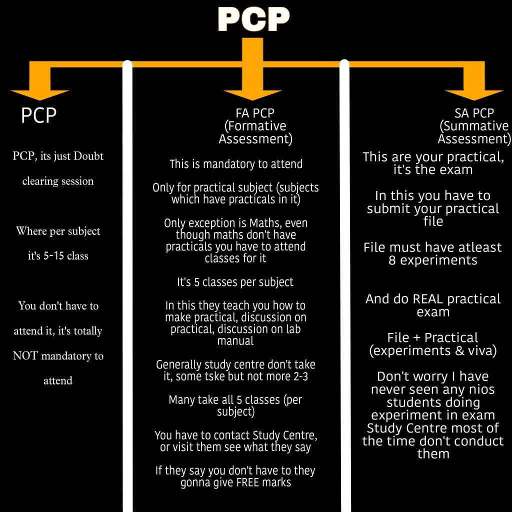

-------------------------

## Things that Every NIOS Student Should Know!
---

## ⚠️ Stream 2 / 3 / 4 Students 
(Read Carefully)

- ❌ No TMA  
- ❌ No PCP  
- ❌ No FA PCP  
- ✅ Only:
  - Theory exam
  - Practical exam (SA – 100%)
- Jump to SA PCP [(practical exam)](/wiki/Exams-Assignments.md#sa-pcp-practical-examination)

📌 Still prepare a **practical file for practical subjects**  
(minimum **10 experiments**)

## 1️⃣ TMA (Tutor Marked Assignment)

### What is TMA? (Simple version)

**TL;DR:**  
TMA is **mandatory** to upload and it happens **only once**, all Online Process.

Here’s what you actually do:
- NIOS gives **5 questions per subject** on your NIOS account - TMA section

- You:
  - Make a **handwritten assignment file**
  - Write the **questions + answers**
  - Convert it to **PDF**
  - Log in to your NIOS Student Account and Upload it **before the deadline**

- Ideal TMA marks are 16 to 18
- Best time to upload TMA is MID
- If you miss the deadline → **no marks** (and yes, regret later)
- If you miss your TMAs and Exa, then you can pay exam fees of next exam cycle, for example, for OCT, then also submit your TMA

You get **20 marks per subject** for TMA. These marks show on your dashboard and marksheet.

### 📅 TMA Deadlines

| Block | TMA Starts | Last Date |
|------|-----------|----------|
| S1 Block 1 | MID November | 31 January |
| S1 Block 2 | June | 31 July |

👉 **Miss the date = zero marks**

### What TMA actually is (official meaning)
- TMA = **Tutor Marked Assignment**, all online process
- Also called **Internal Assessment (IA)**
- It carries **20% of theory marks**
- Final theory marks =  
  **20% TMA + 80% Theory Exam**

📌 **Important Notes**
- TMA is **only for Stream 1 students**
- TMA marks appear on the **final marksheet**
- TMA marks carry forward if you give exam again

### TMA Marking Scheme
- TMA Marking Scheme for different subjects is different, because some have practicals and some don't
- On NIOS Dashboard and result, ex - PCB on dashboard out of 20, but in result out of 16 (cuz 20 marks practical, 64 Theory, 16 TMA)
- See FUll TMA marking scheme **[Click HERE](https://www.reddit.com/r/Nios_unofficial/comments/1l8jzfi/nios_marking_scheme_with_tma_adjustment_practical/)**

---

## 📘 How to make TMAs / Solved TMAs??
**See this TMA guide: *[link here](/wiki/how%20to%20make%20TMA.md)***

---

## 2️⃣ PCP (Personal Contact Programme)

### What is PCP?
- PCP are non-compulsory **doubt-clearing sessions**
- Conducted by your study center on **weekends / holidays**
- Only for **Stream 1 students**

📢 **Important**
- Do **NOT** expect full classroom teaching
- Teachers only help with **doubts**, nothing more
- PCPs are **not compulsory**
- PCPs **do not carry marks**
- PS- Nobody visits it, but you should for 1 or 2 times to make good contact with teachers

**Block-1 April**
- PCP/Doubt Clearing: **MID Nov-Jan**

**Block-2 October**
- PCP/Doubt Clearing: **From MID May-June**

---

## 3️⃣ FA PCP & Practical Classes

### What is FA PCP?
FA pcp are 5 practical classes held at your study center, only for the practical subject, where they teach you.
- Teachers guide you on:
  - How to write the **practical file**
  - How to prepare for the **practical exam**
  - What will happen in **Practical exam**

### Marks Distribution (Very Important)

- Overall Practical Marks = 50% FA (Practical Classes) + 50% SA (Practical Exam)
- Means for subject like PCB,PE = FA marks = 10  + SA marks 10 = total 20

### IMP points of FA PCP?
- Only for **Stream 1 students, not Stream 2,3,4**
- Only for subjects **with practicals** [Subjects with practicals Link](/wiki/pr.md)
- FA PCP = **5 compulsory practical classes**
- Conducted by your **allotted study centre**

⚠️ **PCP vs FA PCP**
- PCP → doubt sessions (non-compulsory)
- FA PCP → compulsory, **carry marks**

⚠️ **Streams Difference**
- Stream 1 → FA + SA
- Stream 2/3/4 → Only SA (100% practical exam)

### 📅 FA PCP AKA Practical Classes (Stream 1)

| Block | Component | Dates |
|-----|----------|------|
| S1 Block 1 | FA PCP | 1 Feb – 10 March |
| | Practical Exam (SA) | After 10 March |
| S1 Block 2 | FA PCP | 1 Aug – 10 Sept |
| | Practical Exam (SA) | After 10 Sept |

📌 NIOS gives **general dates only for FA PCP**  
📌 Exact dates are given by **your study centre**, so it's imp that you **visit** your center before hand

- **Full Study Center Guide, When to visit, What to ask? [ Click Here](https://www.reddit.com/r/Nios_unofficial/comments/1lx0f86/when_to_contact_your_nios_study_center_and_how_to/)**

---

### ❗ Passing Rule (Class 12)
- You need **33% in practicals separately (FA + SA)**
- If you fail → marksheet shows **SYCP**  
  (Subject Yet to Clear in Practical)

---

### 💸 Fees (Very Important)

- ❎ No extra fee for FA PCP (same admission year)
- ❎ Practical exam fee is **already included** in exam fee
- ❎ Do **NOT** pay:
  - Study centre
  - Teachers
  - Anyone else
 
- What is FA PCP exam fees?- [Read this](https://www.reddit.com/r/Nios_unofficial/comments/1m3q6vu/fa_pcp_fee_and_exam_fee_guide_new/?share_id=WKsgvTClDB4sAKtv6t8sR&utm_medium=android_app&utm_name=androidcss&utm_source=share&utm_term=1)

If someone asks for money → **they’re wrong**

## SA PCP (Practical Examination)

Practical examinations are conducted at your study centre/AI (in most cases) 1 month or 2 weeks before the public exams. For on-demand exams, **please ask at the exam center for the date and time on the day of the theory paper.** [Detailed info on practicals](/wiki/pr)

### What happens in SA PCP? Practical exam?
**Happens In Two Part**
- 1st You submit Your Practical File in which you write 10 to 12 experiments, and 
- 2nd They will take the written practical too 
  - Give you a sheet to write 2-3 easy experiments
- Questions come from:
  - Practical file
  - Practical manual
  - or just very basic

- **5% chance:** that they may take Written + Viva
  - Very basic conceptual questions

**Dates of Practical Exam:**
- **Block-1 April:**   2nd week of March
- **Block-2 October:** 2nd week of September

## IMP Related links:
1. This is where you will get your [FA, SA, And Exam hall ticket, 1 or 2 week before](https://sdmis.nios.ac.in/search/fa-hall-ticket)
2. How TO make THE Practical file? SOlved Practicals? - [Click HERE](/wiki/howto-rec-book.md)
3. Read Other students Practical Exam experience, to learn more - [Click Here](https://www.reddit.com/r/Nios_unofficial/comments/1ner92o/prmegathread_oct_2025_nios_practicals_stream_1/)

## PE (Public Examination)

- The Public Examinations(theory exam) are held **twice** a year in the months of April-May and October-November. Eligibility criteria for writing PE: all students admitted under **stream 1 & 2** can pay the exam fees and appear for the exam. [How to pay exam fees?](https://drive.google.com/file/d/1SQAL7MZbkI2XUnyTSU0Nl0RbVB82HXKF/view?usp=drivesdk)

- IF you gave exam in April or oct and if you failed, got low marks , then you can give exam again in oct or april, you just pay exam fees which opens after your result. TMA, FA and SA pcp marks carry forward, if you want you can give practicals exam again too with theory!

- STREAM 3,4 (ODE) can't give Public exam, they can only give ODE in JAN TO March or July to  Sept

> Please note that **students of stream 2 pay exam fees for first exam while taking admission, but later if they want to give exam again they will have to pay exam fees.** 

## ODE (NIOS Improvement Exam)
- [Read Full NIOS ODE Information](/wiki/Full%20ODE%20Information.md)

**So listen—better you hear this now than cry about it later.**
No one owes you anything & Nios alr sucks with help. Take control of your life. Follow the guides here, they will clear all the stuff , Keep yourself NIOS updated from anywhere yt, telegram, reddit , discord.
Don't be DumbAs* follow the NIOS deadlines!

### TIMELINE (gives you a general IDEA, bookmark this shi)

a) [STREAM 1 BLOCK 1](/wiki/HandbookforS1b1.md#important-dates)

b) [STREAM 1 BLOCK 2](/wiki/HandbookforS1b2.md#important-dates)

c) [How To Start Studying, What to study and TIPS??](/wiki/How-To-Study&Prep.md))

d) [Study Center Guide, When to visit? for what? what to ask?](https://www.reddit.com/r/Nios_unofficial/comments/1lx0f86/when_to_contact_your_nios_study_center_and_how_to/?share_id=UC7HWipxwluwjN0bO3vO7&utm_medium=android_app&utm_name=androidcss&utm_source=share&)

e) [NIOS Passesd Students Experiences?](/wiki/experiences.md)
