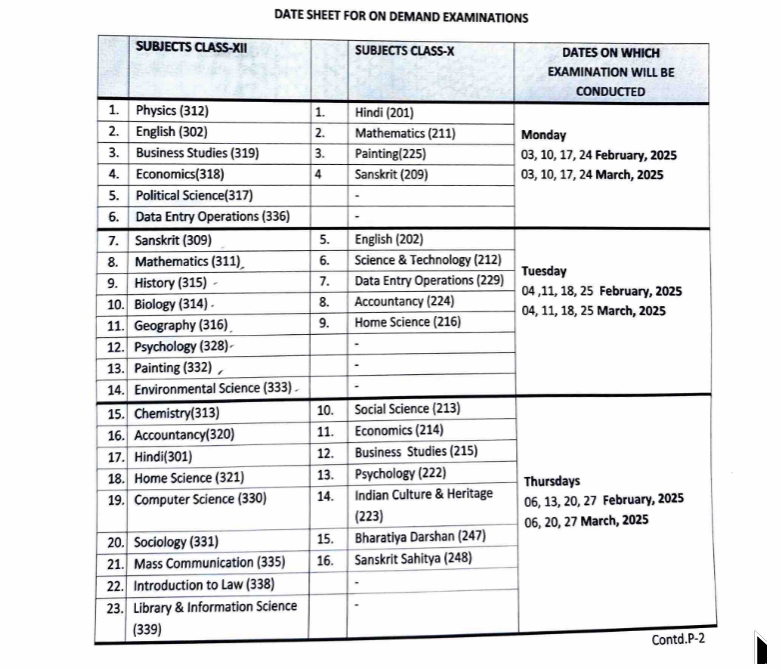
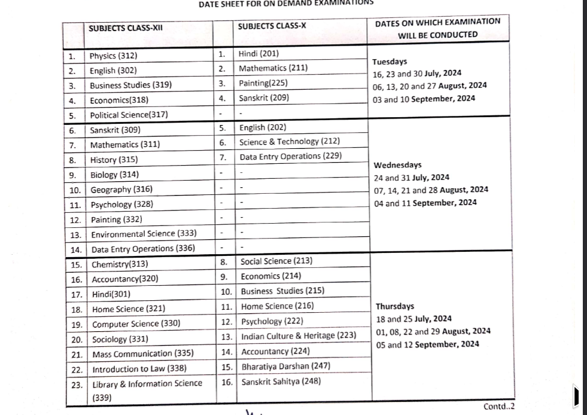
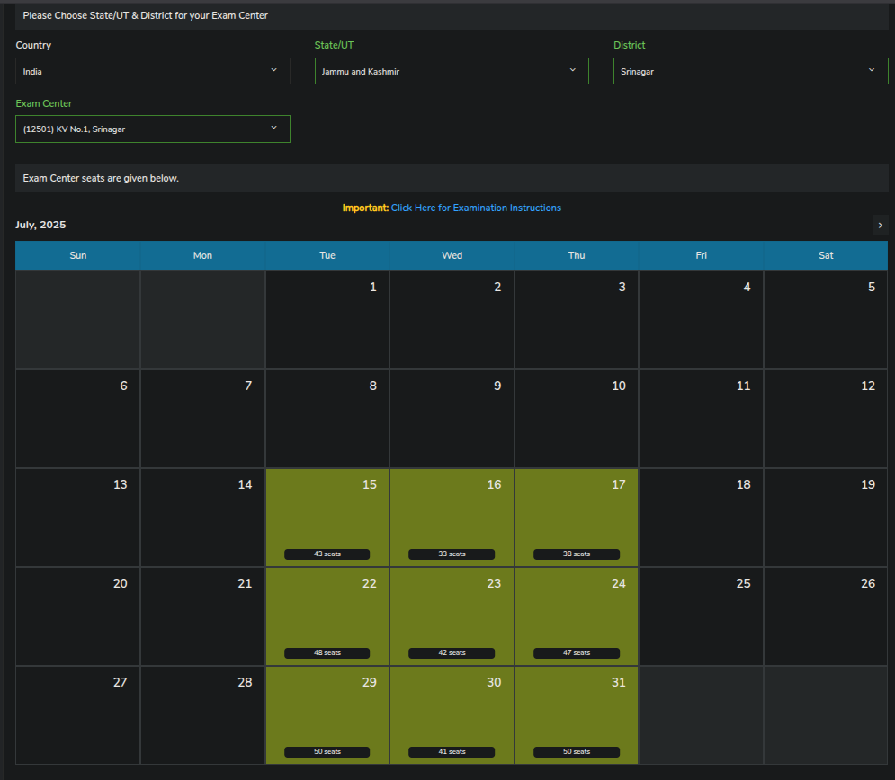
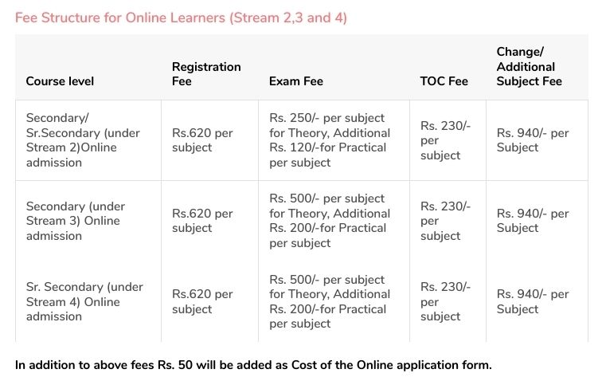

## What is NIOS ODE?

ODE (On-Demand Examination) is a flexible examination system offered by NIOS. It allows students to choose their exam centres based on their convenience. It is available for both Class 10 (Sec) (Stream 3) and Class 12 (Sr. Sec) (Stream 4) levels.

ODE runs under two main categories of students:

### 1. Failed/Compartment Students from Other Boards (CBSE, ICSE, State Boards)
- For students who have failed in one or more subjects in their previous board exams.
- NIOS ODE allows them to reappear in those subjects—or even change the subject (to an easier elective or one of their choice).

#### 🧾 ToC (Transfer of Credit)
- You can transfer up to two passed subjects' marks from your original marksheet (e.g., CBSE) to NIOS.
- Final result: A combined NIOS marksheet showing 5 subjects (2 from CBSE, 3 from ODE).
   **TOC option is only for = failed students**

**📝 Important (If you are from a different board and going for TOC in NIOS):**
- Even if you failed in just one subject (e.g., Physics), you must choose at least 3 subjects to appear for under ODE, so that you will get a marksheet of 5 subjects.If you do TOC. These subjects can be:
  - Failed subjects
  - New subjects (see below for options)
  - Previously passed subjects (to improve score or make up the required marks)
- but it also depends upon your goal, like NEET accepts dual marksheet, but JEE (JOSSA, NTA doesn't), so you would need a single marksheet

### 2. Passed Students (Dual/Part Admission)
- For students who have already cleared Class 10 or 12 but want to add new subjects for:
  - College eligibility
  - Course requirements
  - Personal improvement

**Key Points:**
- You can take 1-4 subjects under ODE.
- ToC is not allowed in this category. You’ll receive a separate NIOS marksheet for these subjects (no combined result with your CBSE/State board marksheet).

---

## How Does the ODE Exam Work?

- ODE is available year-round except during April-May and October-November, when public board exams are held.

- Registration for July To Sept ODE starts from the End of June or early July, and Registration for February to March ODE starts from the end of Jan

- Registration opens after public exam results are out, 10 to 15 days before the ODE exam cycle begins.

- Exam slots fill fast—select your centre quickly, or you might have to travel far.

- You give one subject exam a day, not 2!
  
- You can give a reexam for the same subject too, but only once a month (means one in aug, then in sept) !

- If you give more exams for the same subject more than once, then only the best score out of all will be counted!

- You will get your results within 45 to 55 days after giving your last exam.

---

## HOW ODE Date Sheets LOOKS LIKE

- **(FEB TO MARCH 2025)**
  
- **(JUNE TO SEPTEMBER)**
  

---

## 🧾 Registration & Attempts

- Once you register, you’ll get a schedule with exam slots per subject.
  
- Each subject allows multiple attempts (as you can see in the datesheet), but not within the same month—only next month.
  
- If you feel your first attempt went poorly, you can register for a second attempt after the first exam.
  
- You can expect results within 45–55 days after the exam.

---

## Ways to Approach ODE for Failed Students

There are two ways to approach these exams as a failed student, depending on your readiness and requirements like counselling, deadlines, etc.

**Type 1: "I want my result quickly" (for counselling, university deadlines, etc.)**
- Register as soon as the window opens.
- Pick the earliest slots.
- Be prepared to take exams back-to-back.

---

## Common ODE FAQs

**I missed all 5 subjects in the public exam. Can I give ODE Exam?**
- Yes, Now you can! If you missed all your public exams, only then, not before real exams! 

**When will I get my result?**
- You can expect results within 45–55 days after your last exam.
- (But keep in mind that NIOS can be slow.)

**Syllabus for ODE Exams: Subjects?**
- Only public exam chapters, no TMA chapters! Sometimes, 2-3 questions from TMA chapters may appear by mistake. Check out the RTI we filed:

  >!Bonus - How to study? Study material? What to skip? What to focus on?
  >[Click here](/wiki/Study-materials.md)

## Are there TMA chapters in ODE?
- No, you only have to study for public exam chapters for all exams in NIOS!
- Here is the RTI we filed to NIOS asking the same:
  
  
  >!But sometimes NIOS does add a few questions from TMA chapters.
  

  
**What is ToC (Transfer of Credit)?**
- It allows you to transfer marks from up to 2 previously passed CBSE subjects into your NIOS marksheet.
- Only available to board students who failed and are redoing 3 subjects via ODE.
- **- TOC is only for = Faild students, not passed**

**Can I get a combined marksheet of my old board and NIOS?**
- Only failed students using the ToC option can get a combined NIOS marksheet (with 2 ToC subjects + 3 ODE subjects).
- **TOC is only for = failed students**
  
- CBSE-passed students who registered under Dual/Part Enrollment will get a separate mark sheet for the passed subjects.

**Are there practicals under ODE?**
- Yes. If the subject has practicals, you must complete both theory and practical exams.
- (See [this page](/wiki/pr.html#practical-exam) for subjects with practicals.)

**When will the practical exam happen??**
 - On the day of the theory exam, you will have to ask your exam centre! When do you come for the practical exam?

**Can I choose any centre in any state?**

Yes, but centres get booked quickly. Select your exam centre as soon as registration opens.
You can check the availability of seats for ODE at any center here: <a href="https://sdmis.nios.ac.in/registration/exam-center-seats" target="_blank" rel="noopener noreferrer"><b>Check ODE Exam Centre Seat Availability</b></a>.

<b>How to check ODE exam centre seat availability (step-by-step)</b>

1. Go to the <a href="https://sdmis.nios.ac.in/registration/exam-center-seats" target="_blank" rel="noopener noreferrer">ODE Exam Centre Seat Availability</a> page.
    
  > Sometimes the link may show an error like "<i>You are not allowed to perform this action.</i>" If this happens, simply open the link in a private/incognito window.

2. Select your  <b>State/UT</b> and <b>District</b> from the dropdown menus.
3. Choose your preferred/nearest <b>Exam Center</b> from the list.
4. The available seats for the selected center will be displayed below.
5. after checking availability, register for the ODE exam as soon as possible to secure your seat. scroll to the bottom of the page to see registration procedure.

  
   
  <em>Screenshot: ODE Exam Center Seat Availability page</em>

**Fees & Documents?**
- (Refer to the official NIOS fee chart or the image shared separately for exact amounts)
   (this is old fees, the new ones are in NIOS prospect)
- Fee varies per subject.
- Extra charges apply for practicals.
- TOC has an additional fee.
- You’ll need your Aadhaar, previous mark sheets, passport size photograph, and full name signature on white paper during registration.

---
### How to register for ODE?

**For NIOS Students:**
> If you are already a NIOS student and either failed in some subjects or want to give an improvement exam by ODE, the ODE portal opens after all the results of NIOS 12th & 10th are declared. You won't have to take admission again; you can register for ODE from your dashboard. You will get updates in both our subreddit and our Discord server.

**For Other Board Students (CBSE, ICSE, State Board):**
> You will enrol in stream 4 directly. The ODE portal opens after all the results of NIOS 12th & 10th are declared. You won't have to take admission again; you can register for ODE from your dashboard. You will get updates in both our subreddit and our Discord server.
 

  <!-- <a href="./assets/Registration_Process_for_On-Demand Exams.png" target="_blank"> -->
    
  <!-- </a> -->
   
  <em>Figure: Registration process flow chart for ODE</em>

 

  for step-by-step guide on how to register, please refer to the <a href="https://dq4kzxd7fbbni.cloudfront.net/static/dist/images/pdf/process-flow/ProcessFlowDetailed_On-Demand_Stream3and4_June2023.pdf" target="_blank" rel="noopener noreferrer"><b>Registration Process (PDF)</b></a>.
     
  Sometimes the link may show an error like "<i>You are not allowed to perform this action.</i>" If this happens, simply open the link in a private/incognito window.

----------------

# Experiences to learn from

  -  ODE Students EXAM Experiences (Mega-Thread)                              [Link to section](https://www.reddit.com/r/Nios_unofficial/comments/1m07dj8/nios_ode_exam_megathread_starting_15th_july_to/?share_id=GW5quiQFrDNkEV-mqL7oz&utm_medium=android_app&utm_name=androidcss&utm_source=share&utm_term=1)
  
  -  ODE Passed Students Result Experience (Mega-Thread)                       [Link to section](https://www.reddit.com/r/Nios_unofficial/comments/1nfzful/ode_result_discussion_megathread/)

---
## Credits for writing this page

- **VIDMAHI** - *bis_its_vid*
- **Hrithik** - *hrithk*
- **Tamim** - *kotaro*
